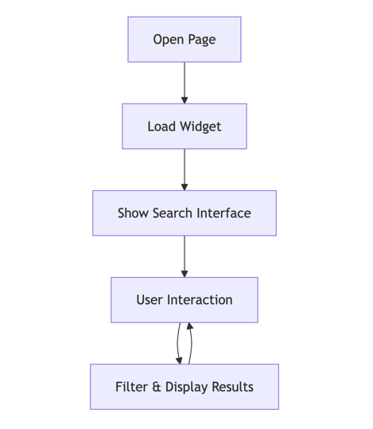

### 1. What plugins/extensions did you use? Briefly explain why.

It is written with Angular 18 and mostly @angular/material
components just not to waste too much time on styling.
Angular CDK was necessary for implementing the drag-and-drop
functionality and handling user interactions. RxJS was used for
managing data streams and component communication, which is
essential for search functionality and state management.

### 2. How would you implement multilingual support for the types and names?

I would use ngx-translate for multilingual support which I used to implement :)

P.S. One of the last projects I was working on was supposed to support EN and hebrew
and I was surprised how easy it was to implement right-to-left support with Angular Material. :D

### 3. How would you handle data in different formats (e.g., PascalCase vs camelCase)?

I would create a data transformer service that converts incoming data
from the server's format to the client's format, for example.

### 4. Create a flowchart describing how the widget works.

I am not good at drawing flowcharts but still...

### 5. How would you mock the data if the server isn't ready?

Hm, I didn't read questions before I finished the task.
I would create a mock service that returns hardcoded data in the same 
format that the real API would use. This service would be implemented using
Angular's HTTP interceptors, which can intercept API calls and return mock data instead.

And I didn't think about mocking a lot while implementing the task. :D So it is just simply inside the service.
